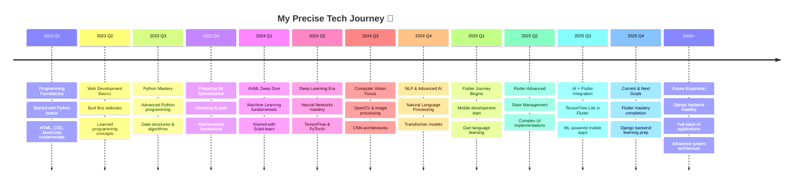

<div align="center">

  <!-- Dynamic Header with Typing Animation -->
  <a href="https://git.io/typing-svg">
    
  </a>
  <!-- Animated Divider -->
  

</div>

<!-- Hero Section with Enhanced Floating Cards -->
<div align="center">
  <table border="0" cellspacing="0" cellpadding="0">
    <tr>
      <td align="center" width="20%">
        
        <h4>🔥 Coding Enthusiast</h4>
      </td>
      <td align="center" width="20%">
        
        <h4>🚀 Innovation Driven</h4>
      </td>
      <td align="center" width="20%">
        
        <h4>🤖 AI Specialist</h4>
      </td>
      <td align="center" width="20%">
        
        <h4>📱 Flutter Developer</h4>
      </td>
      <td align="center" width="20%">
        
        <h4>🔥 Lifelong Learner</h4>
      </td>
    </tr>
  </table>
</div>

<!-- Enhanced Animated Rainbow Divider -->


## 🌟 About Me

<div align="center">
  
</div>

```yaml
name: "Abdelrahman (AbdoTechno)"
role: "AI Engineer & Flutter Developer"
location: "Egypt 🇪🇬"
journey_started: "2023 (Programming Fundamentals) 🚀"
specialization: "AI/ML + Mobile Development"
passion: "Building intelligent mobile applications"
motto: "Learn, Build, Innovate, Repeat"

current_learning:
  - Advanced Neural Networks & Deep Learning
  - Flutter Advanced Animations & State Management  
  - Django Backend Development (Next Goal!)
  - Computer Vision & Image Processing
  - Natural Language Processing (NLP)
  - MLOps & Model Deployment

learning_timeline:
  - "2023: Programming Fundamentals & Python"
  - "2024: AI/ML Deep Dive & Mastery"
  - "2025: Flutter Development Journey"
  - "Next: Django Backend Mastery"

fun_fact: "From zero to AI + Flutter developer in just 2 years! 🔥"
```

<!-- Enhanced Tech Stack with Modern Icons and Animations -->
## 🛠️ Tech Arsenal

<div align="center">
  
</div>

<div align="center">

### 🤖 AI/ML Ecosystem
<p>
  
  
  
  
  
  
</p>

### 📱 Mobile Development Kingdom
<p>
  
  
  
</p>

### 🎨 Frontend Universe
<p>
  
</p>

### ⚙️ Backend Development (Learning Next!)
<p>
  
  
  
</p>

### 🗄️ Database Kingdom
<p>
  
</p>

### 🛠️ DevOps & Tools
<p>
  
</p>

### ☁️ Cloud Platforms
<p>
  
</p>

</div>

<!-- Enhanced Animated Stats Section -->
## 📊 GitHub Analytics

<div align="center">
  
</div>

<div align="center">
  <table>
    <tr>
      <td>
        
      </td>
      <td>
        
      </td>
    </tr>
  </table>

  <table>
    <tr>
      <td>
        
      </td>
      <td>
        
      </td>
    </tr>
  </table>

  <!-- GitHub Trophies -->
  

</div>

## 🎯 Featured Projects

<div align="center">
  
</div>

<div align="center">

[](https://github.com/AbdoTechno/braille-converter)
[](https://github.com/AbdoTechno/ai-chatbot)

</div>

## 💼 Professional Journey

<div align="center">
  
</div>

<div align="center">



</div>

## 🔮 Future Learning Path

<div align="center">
  
</div>

<div align="center">

| 🎯 Short Term (2025) | 🚀 Medium Term (2025-2026) | 🌟 Long Term (2026+) |
|----------------------|----------------------------|----------------------|
| 📱 Flutter Mastery | 🌐 Django Backend Expert | 🤖 AI Research |
| 🧠 Advanced AI Models | 🔗 Full-Stack Integration | 🚀 Startup Launch |
| 🎨 Flutter Animations | 🏗️ System Architecture | 🌍 Global Impact |
| 📊 ML Production | 📈 Scalable Applications | 🧬 Bio-AI Integration |
| 🔧 Django Fundamentals | 🎮 Real-time Systems | 🔮 Future Tech Innovation |

</div>

## 🌐 Connect With Me

<div align="center">
  
</div>

<div align="center">

[](https://www.linkedin.com/in/abdotechno/)
[](https://twitter.com/AbdoTechno)
[](mailto:abdelrahman.techno@gmail.com)
[](https://t.me/AbdoTechno)
[](https://github.com/AbdoTechno)

</div>

## 📈 Activity & Contributions

<div align="center">

<!-- GitHub Activity Graph -->


<!-- Contribution Snake -->
<picture>
  <source media="(prefers-color-scheme: dark)" srcset="https://raw.githubusercontent.com/AbdoTechno/AbdoTechno/output/github-snake-dark.svg">
  <source media="(prefers-color-scheme: light)" srcset="https://raw.githubusercontent.com/AbdoTechno/AbdoTechno/output/github-snake.svg">
  
</picture>

</div>

## 🎮 Coding Stats

<div align="center">
  
</div>

<div align="center">

<!--START_SECTION:waka-->
```text
Python       15 hrs 45 mins  ████████████░░░   52.3%
Dart         8 hrs 30 mins   ███████░░░░░░░░   28.2%
JavaScript   3 hrs 15 mins   ███░░░░░░░░░░░░   10.8%
SQL          1 hr 45 mins    ██░░░░░░░░░░░░░    5.8%
YAML         55 mins         █░░░░░░░░░░░░░░    2.9%
```
<!--END_SECTION:waka-->

</div>

## 🏆 Achievements & Milestones

<div align="center">
  
</div>

<div align="center">

| Achievement | Description | Year |
|-------------|-------------|------|
| 🚀 **Journey Started** | Programming fundamentals & Python | 2023 |
| 🤖 **AI Specialist** | Mastered ML & Deep Learning | 2024 |
| 📱 **Flutter Journey** | Started mobile development | 2025 |
| 🌟 **Current Focus** | AI + Flutter Integration | 2025 |
| 🎯 **Projects Built** | 10+ AI-powered applications | 2024-2025 |
| 🏅 **Community** | Tech Content Creator | 2024-2025 |
| 🔮 **Next Goal** | Django Backend Mastery | 2025-2026 |

</div>

## 🔥 Current Goals & Vision

<div align="center">
  
</div>

<div align="center">

```yaml
2025_roadmap:
  current_focus:
    - "Complete Flutter Mastery"
    - "AI Model Optimization"
    - "Mobile AI Integration"
    - "Advanced State Management"
  
  next_major_step:
    - "Django Backend Development"
    - "REST API Design & Development"
    - "Database Architecture"
    - "Full-Stack Integration"
  
  projects:
    - "AI-powered Flutter Applications"
    - "Computer Vision Mobile Apps"
    - "Django Backend Services"
    - "Full-Stack AI Platform"
  
  community:
    - "Flutter + AI Tutorial Series"
    - "Django Learning Documentation"
    - "Mentoring New Developers"
    - "Building Developer Community"

journey_summary:
  2023: "Programming fundamentals & Python basics"
  2024: "AI/ML specialization & deep learning mastery"
  2025: "Flutter development & mobile AI integration"
  2026: "Django backend & full-stack expertise"

vision: "Building end-to-end AI solutions from mobile frontend 
         to intelligent backend systems"
```

</div>

## 📚 Learning Resources I Recommend

<div align="center">
  
</div>

<div align="center">

| 🤖 AI/ML | 📱 Flutter | 🐍 Django (Next!) |
|----------|------------|------------------|
| Fast.ai | Flutter.dev | Django Docs |
| Coursera ML | FlutterFlow | Django Girls |
| Papers With Code | Reso Coder | Real Python |
| Kaggle Learn | Flutter Community | Django Tutorial |
| PyTorch Tutorials | Flutter Explained | Two Scoops Django |

</div>

<!-- Enhanced Animated Footer -->
<div align="center">
  
  
  
  
  
  ### 💫 "The best time to plant a tree was 20 years ago. The second best time is now."
  ### 🚀 Started in 2023 • Still Learning • Still Growing
  
  
  
  
  
  <p><b>❤️ Made with passion and dedication by AbdoTechno</b></p>
  <p><i>🌟 2023: Basics → 2024: AI Master → 2025: Flutter Dev → Next: Django! 🚀</i></p>
  
  <!-- Random Dev Quote -->
  
  
</div>

<!-- Enhanced Easter Egg -->
<div align="center">
  <details>
    <summary>🎁 Click for a special message!</summary>
    <br>
    
    <h3>🚀 My Specialized Learning Journey</h3>
    <p><b>2023:</b> Programming fundamentals - Started from absolute zero!</p>
    <p><b>2024:</b> AI/ML mastery - Deep learning, computer vision, NLP</p>
    <p><b>2025:</b> Flutter development - Building beautiful mobile apps</p>
    <p><b>Next:</b> Django backend - Completing the full-stack puzzle!</p>
    <p><i>"Focused learning beats scattered knowledge every time!" 🎯</i></p>
    
    <p><b>Thanks for visiting! Keep coding, keep learning! 💪</b></p>
  </details>
</div>

<div align="center">
  
</div>
